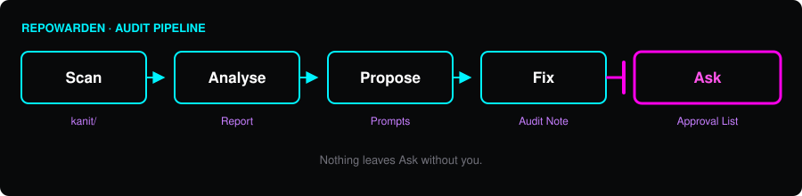

<!-- lang -->

[](README.tr.md)



# RepoWarden

Repository audit for GitHub accounts.

## What Is It

RepoWarden reads every repository in a GitHub account through `gh api` and tells you what is broken in the publishing layer. Not the code, the layer around it: releases, README, licence, topics, branch names, the files GitHub expects to find and does not.

It groups the findings by severity and writes a report you can read before anything moves. Then it applies the fixes you approve. Anything destructive stops and waits for a sentence from you.

The first run found two repositories whose one-line installer had been returning 404 for months, in public, with nobody noticing. One of them was mine.

## Doesn't `gh` Already Do This?

`gh` gives you the data. It will list your releases, print your topics, show your branch protection, and it does all of that better than any wrapper would.

What it will not do is look at fourteen releases, notice every single one is a draft, connect that to the `releases/latest` URL in your install script, and tell you your users cannot install your software.

- **Cross-checks facts that live in different places.** The version in `package.json`, the version in the README, the newest tag, the newest release. Four numbers that should agree and usually do not.
- **Reads your documents as documents.** A relative link that works in your editor and 404s on GitHub. A clone URL pointing at someone else's fork. A personal filesystem path left in a public file.
- **Looks at the account, not just the repository.** No `.github` repository means no sponsor button and no security policy anywhere you own.
- **Ends in commands, not a score.** Every finding arrives with the `gh` line that fixes it.

## Features

- **Full-account scan.** One pass over every repository, public and private, with the raw `gh api` output kept as evidence under `kanit/`.
- **Findings by severity.** Critical means users are affected right now, today, without knowing it.
- **A prompt per repository.** Copy-paste text listing the finding, the command and the constraint. Hand it to an agent or run it yourself.
- **An audit note left behind.** Each repository gets `docs/github-audit-<date>.md`: what changed, what is still open.
- **Destructive actions queued, never taken.** Deleting a release, deleting a remote tag, renaming a repository, moving a default branch. See *How It Works*.
- **Both languages.** Repository documents come out English. The working report can be either.

## What It Does Not Do

- It does not read your source code. No linting, no dependency audit, no vulnerability scan.
- It never runs a destructive command. Findings become issues, not deletions.
- It does not audit private repositories unless `rules.json` says so.
- It cannot tell you whether your project is any good. It only checks that what you published matches what you claimed.

## Requirements

```bash
gh auth status
```

GitHub CLI, authenticated, and Node.js 18 or newer. Read access is enough to scan. Write access is needed to open issues.

## Run It

```bash
node bin/repowarden.mjs
```

A dry run: it prints the report and writes it to `reports/audit-<date>.md`. Add `--issues` to open one issue per repository, labelled `repowarden`. The next run edits that issue, and closes it once nothing is left. `--repo <name>` audits one repository. The checks live in `rules.json`.

## How It Works

Five steps. Each one leaves a file behind, so you can stop after any of them and still have something.

1. **Scan** — every repository's metadata dumped raw into `kanit/`.
2. **Analyse** — findings grouped by severity, one section per repository.
3. **Propose** — a copy-paste prompt per repository, with the exact commands.
4. **Fix** — non-destructive changes applied and pushed, audit note written.
5. **Ask** — destructive changes listed, explained, and left alone.

Step 5 is the whole point. A tool that deletes thirteen draft releases without asking is not an auditor, it is an accident with good intentions.

| First run, 2026-09-08 | |
|---|---|
| Repositories scanned | 15 |
| Repositories changed and pushed | 13 |
| Repositories created | 1 |
| Critical findings | 2 |
| Destructive actions queued for approval | 7 |

These numbers come from one run against one account. They record what happened; they are not a benchmark, and nothing here has been measured against any other tool.

## What It Looks Like In Use

```
| Repo        | Status   | Main problem                                               |
|-------------|----------|------------------------------------------------------------|
| Ghostlist   | CRITICAL | all 4 releases are drafts -> releases/latest 404           |
| ProcWitness | CRITICAL | all 14 releases are drafts -> installers 404 on 3 platforms|
| CodeXRay    | HIGH     | README clones srknzl/CodeXRay, a fork of this repo         |
| Runly       | LOW      | unreleased fixes in CHANGELOG; screenshot two versions old |
```

## Contributing

Open an issue before a pull request, so neither of us writes the same thing twice. Keep the pull request to one subject.

The repository language is English: code, commit messages, documents. Contributions are accepted under the project's own licence, inbound equals outbound. No CLA, no sign-off to remember.

If this saved you an afternoon, [sponsorship](https://github.com/sponsors/Teknesyum) keeps it maintained.

## License

AGPL-3.0-or-later — see [LICENSE](LICENSE).

<!-- signature -->
<div align="center">

<a href="https://github.com/sponsors/Teknesyum"></a>
&nbsp;
<a href="LICENSE"></a>

</div>
