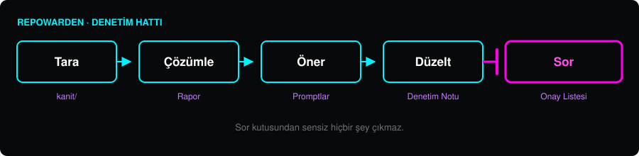

<!-- lang -->

[](README.md)



# RepoWarden

GitHub hesapları için depo denetimi.

## Nedir

RepoWarden bir GitHub hesabındaki bütün depoları `gh api` üzerinden okur ve yayın katmanında ne bozuksa söyler. Kodu değil, kodun etrafındaki katmanı: release'leri, README'yi, lisansı, konu etiketlerini, dal adlarını, GitHub'ın bulmayı beklediği ve bulamadığı dosyaları.

Bulguları önem sırasına dizer ve hiçbir şey kıpırdamadan önce okuyabileceğin bir rapor yazar. Sonra onayladığın düzeltmeleri uygular. Yıkıcı olan her şey durur ve senden bir cümle bekler.

İlk koşum, tek satırlık kurulum komutu aylardır 404 dönen iki depo buldu. İkisi de herkese açıktı, kimse fark etmemişti. Biri benimdi.

## `gh` Bunu Zaten Yapmıyor Mu?

`gh` veriyi verir. Release'lerini listeler, konu etiketlerini yazar, dal korumasını gösterir; hepsini de hiçbir sarmalayıcının yapamayacağı kadar iyi yapar.

Yapmadığı şey şu: on dört release'e bakıp hepsinin taslak olduğunu görmek, bunu kurulum betiğindeki `releases/latest` adresine bağlamak ve sana kullanıcılarının yazılımını kuramadığını söylemek.

- **Ayrı yerlerde duran olguları karşılaştırır.** `package.json`'daki sürüm, README'deki sürüm, en yeni tag, en yeni release. Uyuşması gereken ve genelde uyuşmayan dört sayı.
- **Belgelerini belge olarak okur.** Editörde çalışıp GitHub'da 404 dönen göreli bağlantı. Başkasının fork'unu klonlayan URL. Herkese açık dosyada unutulmuş kişisel dizin yolu.
- **Depoya değil hesaba bakar.** `.github` deposunun olmaması, sahip olduğun hiçbir yerde sponsor butonu ve güvenlik politikası olmaması demektir.
- **Puanla değil komutla biter.** Her bulgunun yanında onu düzelten `gh` satırı gelir.

## Öne Çıkanlar

- **Hesabın tamamını tarar.** Herkese açık ve özel bütün depolarda tek geçiş; ham `gh api` çıktısı kanıt olarak `kanit/` altında durur.
- **Bulgular önem sırasına dizilir.** Kritik demek, kullanıcılar şu anda etkileniyor ve bunu bilmiyorlar demektir.
- **Depo başına bir prompt.** Bulguyu, komutu ve kısıtı sıralayan kopyala-yapıştır metin. İstersen bir ajana verirsin, istersen kendin koşarsın.
- **Arkasında denetim notu bırakır.** Her depoya `docs/github-audit-<tarih>.md` düşer: ne değişti, ne açık kaldı.
- **Yıkıcı işler sıraya alınır, yapılmaz.** Release silme, uzak tag silme, depo adı değiştirme, varsayılan dal taşıma. Bkz. *Nasıl Çalışır*.
- **İki dil.** Depo belgeleri İngilizce çıkar. Çalışma raporu ikisinden biri olabilir.

## Yapmadıkları

- Kaynak kodunu okumaz. Lint yok, bağımlılık denetimi yok, güvenlik açığı taraması yok.
- Yıkıcı komut koşmaz. Bulgular silme değil, issue olur.
- `rules.json` söylemedikçe özel depoları denetlemez.
- Projenin iyi olup olmadığını söyleyemez. Yalnız yayımladığın şeyin iddia ettiğin şeye uyup uymadığına bakar.

## Gerekenler

```bash
gh auth status
```

GitHub CLI, oturum açılmış, ve Node.js 18 ya da üstü. Taramak için okuma yetkisi yeter; issue açmak için yazma yetkisi gerekir.

## Çalıştır

```bash
node bin/repowarden.mjs
```

Kuru koşum: raporu basar ve `reports/audit-<tarih>.md` dosyasına yazar. `--issues` eklersen her depoya `repowarden` etiketli bir issue açar. Sonraki koşum aynı issue'yu günceller, iş kalmayınca kapatır. `--repo <ad>` tek depoyu denetler. Kurallar `rules.json` içinde.

## Nasıl Çalışır

Beş adım. Her biri arkasında bir dosya bırakır, yani hangisinden sonra durursan dur elinde bir şey kalır.

1. **Tara** — her deponun üstverisi ham haliyle `kanit/` altına dökülür.
2. **Çözümle** — bulgular önem sırasına dizilir, depo başına bir bölüm.
3. **Öner** — depo başına kopyala-yapıştır prompt, komutları tam yazılmış.
4. **Düzelt** — yıkıcı olmayan değişiklikler uygulanır, itilir, denetim notu yazılır.
5. **Sor** — yıkıcı değişiklikler sıralanır, açıklanır ve el sürülmez.

Beşinci adım işin özü. On üç taslak release'i sormadan silen bir araç denetçi değildir, iyi niyetli bir kazadır.

| İlk koşum, 2026-09-08 | |
|---|---|
| Taranan depo | 15 |
| Değiştirilip itilen depo | 13 |
| Açılan depo | 1 |
| Kritik bulgu | 2 |
| Onaya bırakılan yıkıcı işlem | 7 |

Bu sayılar tek bir hesaba karşı tek bir koşumdan geliyor. Olanı kaydediyorlar; ölçüt değiller ve buradaki hiçbir şey başka bir araçla karşılaştırılmadı.

## Kullanımda Nasıl Görünür

```
| Depo        | Durum    | Ana sorun                                                  |
|-------------|----------|------------------------------------------------------------|
| Ghostlist   | KRITIK   | 4 release'in hepsi taslak -> releases/latest 404           |
| ProcWitness | KRITIK   | 14 release'in hepsi taslak -> 3 platformda kurulum 404     |
| CodeXRay    | YUKSEK   | README bu deponun fork'unu klonluyor: srknzl/CodeXRay      |
| Runly       | DUSUK    | CHANGELOG'da yayinlanmamis duzeltmeler; ekran goruntusu eski|
```

## Katkı

Pull request'ten önce issue aç, ikimiz de aynı şeyi iki kez yazmayalım. Pull request tek konuda kalsın.

Deponun dili İngilizce: kod, commit mesajları, belgeler. Katkılar projenin kendi lisansı altında kabul edilir, giren ile çıkan aynıdır. CLA yok, akılda tutulacak imza yok.

Bir öğleden sonranı kurtardıysa, [sponsorluk](https://github.com/sponsors/Teknesyum) bakımını sürdürür.

## Lisans

AGPL-3.0-or-later — bkz. [LICENSE](LICENSE).

<!-- signature -->
<div align="center">

<a href="https://github.com/sponsors/Teknesyum"></a>
&nbsp;
<a href="LICENSE"></a>

</div>
